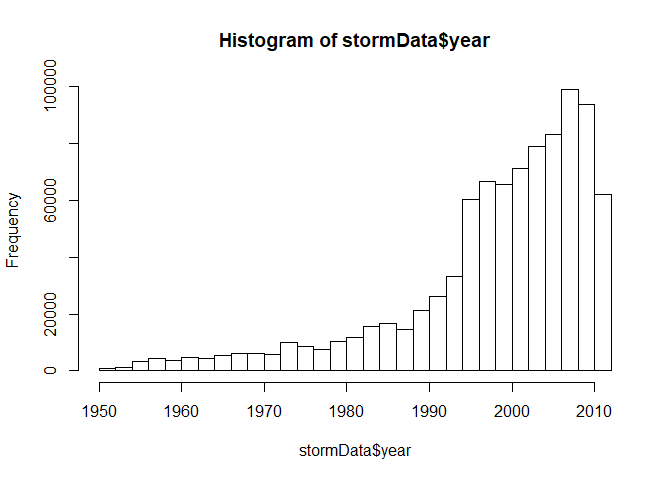

Analysis of acute Weather Events on Public Health and Economy in the United States
----------------------------------------------------------------------------------

Synopsis
--------

In this report, we aim to analyze the impact of different weather events
on public health and economy based on the storm database collected from
the U.S. National Oceanic and Atmospheric Administration's (NOAA) from
1950 - 2011. We will use the estimates of fatalities, injuries, property
and crop damage to decide which types of event are most harmful to the
population health and economy. From these data, we found that excessive
heat and tornado are most harmful with respect to population health,
while flood, drought, and hurricane/typhoon have the greatest economic
consequences.

Required libraries
------------------

    echo = TRUE  # Always make code visible
    options(scipen = 1)  # Turn off scientific notations for numbers
    library(R.utils)

    ## Loading required package: R.oo

    ## Loading required package: R.methodsS3

    ## R.methodsS3 v1.7.1 (2016-02-15) successfully loaded. See ?R.methodsS3 for help.

    ## R.oo v1.20.0 (2016-02-17) successfully loaded. See ?R.oo for help.

    ## 
    ## Attaching package: 'R.oo'

    ## The following objects are masked from 'package:methods':
    ## 
    ##     getClasses, getMethods

    ## The following objects are masked from 'package:base':
    ## 
    ##     attach, detach, gc, load, save

    ## R.utils v2.3.0 (2016-04-13) successfully loaded. See ?R.utils for help.

    ## 
    ## Attaching package: 'R.utils'

    ## The following object is masked from 'package:utils':
    ## 
    ##     timestamp

    ## The following objects are masked from 'package:base':
    ## 
    ##     cat, commandArgs, getOption, inherits, isOpen, parse, warnings

    library(ggplot2)
    library(plyr)
    require(gridExtra)

    ## Loading required package: gridExtra

Data Processing
---------------

Download the Storm data file from given link.

    if (!"stormData.csv.bz2" %in% dir("./data/")) {
      download.file("http://d396qusza40orc.cloudfront.net/repdata%2Fdata%2FStormData.csv.bz2", destfile = "data/stormData.csv.bz2")
        bunzip2("data/stormData.csv.bz2", overwrite=T, remove=F)
    }

Read The data:

    if (!"stormData" %in% ls()) {
        stormData <- read.csv("data/stormData.csv", sep = ",")
    }

Summary of Storm data:

    summary(stormData)

    ##     STATE__                  BGN_DATE             BGN_TIME     
    ##  Min.   : 1.0   5/25/2011 0:00:00:  1202   12:00:00 AM: 10163  
    ##  1st Qu.:19.0   4/27/2011 0:00:00:  1193   06:00:00 PM:  7350  
    ##  Median :30.0   6/9/2011 0:00:00 :  1030   04:00:00 PM:  7261  
    ##  Mean   :31.2   5/30/2004 0:00:00:  1016   05:00:00 PM:  6891  
    ##  3rd Qu.:45.0   4/4/2011 0:00:00 :  1009   12:00:00 PM:  6703  
    ##  Max.   :95.0   4/2/2006 0:00:00 :   981   03:00:00 PM:  6700  
    ##                 (Other)          :895866   (Other)    :857229  
    ##    TIME_ZONE          COUNTY           COUNTYNAME         STATE       
    ##  CST    :547493   Min.   :  0.0   JEFFERSON :  7840   TX     : 83728  
    ##  EST    :245558   1st Qu.: 31.0   WASHINGTON:  7603   KS     : 53440  
    ##  MST    : 68390   Median : 75.0   JACKSON   :  6660   OK     : 46802  
    ##  PST    : 28302   Mean   :100.6   FRANKLIN  :  6256   MO     : 35648  
    ##  AST    :  6360   3rd Qu.:131.0   LINCOLN   :  5937   IA     : 31069  
    ##  HST    :  2563   Max.   :873.0   MADISON   :  5632   NE     : 30271  
    ##  (Other):  3631                   (Other)   :862369   (Other):621339  
    ##                EVTYPE         BGN_RANGE           BGN_AZI      
    ##  HAIL             :288661   Min.   :   0.000          :547332  
    ##  TSTM WIND        :219940   1st Qu.:   0.000   N      : 86752  
    ##  THUNDERSTORM WIND: 82563   Median :   0.000   W      : 38446  
    ##  TORNADO          : 60652   Mean   :   1.484   S      : 37558  
    ##  FLASH FLOOD      : 54277   3rd Qu.:   1.000   E      : 33178  
    ##  FLOOD            : 25326   Max.   :3749.000   NW     : 24041  
    ##  (Other)          :170878                      (Other):134990  
    ##          BGN_LOCATI                  END_DATE             END_TIME     
    ##               :287743                    :243411              :238978  
    ##  COUNTYWIDE   : 19680   4/27/2011 0:00:00:  1214   06:00:00 PM:  9802  
    ##  Countywide   :   993   5/25/2011 0:00:00:  1196   05:00:00 PM:  8314  
    ##  SPRINGFIELD  :   843   6/9/2011 0:00:00 :  1021   04:00:00 PM:  8104  
    ##  SOUTH PORTION:   810   4/4/2011 0:00:00 :  1007   12:00:00 PM:  7483  
    ##  NORTH PORTION:   784   5/30/2004 0:00:00:   998   11:59:00 PM:  7184  
    ##  (Other)      :591444   (Other)          :653450   (Other)    :622432  
    ##    COUNTY_END COUNTYENDN       END_RANGE           END_AZI      
    ##  Min.   :0    Mode:logical   Min.   :  0.0000          :724837  
    ##  1st Qu.:0    NA's:902297    1st Qu.:  0.0000   N      : 28082  
    ##  Median :0                   Median :  0.0000   S      : 22510  
    ##  Mean   :0                   Mean   :  0.9862   W      : 20119  
    ##  3rd Qu.:0                   3rd Qu.:  0.0000   E      : 20047  
    ##  Max.   :0                   Max.   :925.0000   NE     : 14606  
    ##                                                 (Other): 72096  
    ##            END_LOCATI         LENGTH              WIDTH         
    ##                 :499225   Min.   :   0.0000   Min.   :   0.000  
    ##  COUNTYWIDE     : 19731   1st Qu.:   0.0000   1st Qu.:   0.000  
    ##  SOUTH PORTION  :   833   Median :   0.0000   Median :   0.000  
    ##  NORTH PORTION  :   780   Mean   :   0.2301   Mean   :   7.503  
    ##  CENTRAL PORTION:   617   3rd Qu.:   0.0000   3rd Qu.:   0.000  
    ##  SPRINGFIELD    :   575   Max.   :2315.0000   Max.   :4400.000  
    ##  (Other)        :380536                                         
    ##        F               MAG            FATALITIES          INJURIES        
    ##  Min.   :0.0      Min.   :    0.0   Min.   :  0.0000   Min.   :   0.0000  
    ##  1st Qu.:0.0      1st Qu.:    0.0   1st Qu.:  0.0000   1st Qu.:   0.0000  
    ##  Median :1.0      Median :   50.0   Median :  0.0000   Median :   0.0000  
    ##  Mean   :0.9      Mean   :   46.9   Mean   :  0.0168   Mean   :   0.1557  
    ##  3rd Qu.:1.0      3rd Qu.:   75.0   3rd Qu.:  0.0000   3rd Qu.:   0.0000  
    ##  Max.   :5.0      Max.   :22000.0   Max.   :583.0000   Max.   :1700.0000  
    ##  NA's   :843563                                                           
    ##     PROPDMG          PROPDMGEXP        CROPDMG          CROPDMGEXP    
    ##  Min.   :   0.00          :465934   Min.   :  0.000          :618413  
    ##  1st Qu.:   0.00   K      :424665   1st Qu.:  0.000   K      :281832  
    ##  Median :   0.00   M      : 11330   Median :  0.000   M      :  1994  
    ##  Mean   :  12.06   0      :   216   Mean   :  1.527   k      :    21  
    ##  3rd Qu.:   0.50   B      :    40   3rd Qu.:  0.000   0      :    19  
    ##  Max.   :5000.00   5      :    28   Max.   :990.000   B      :     9  
    ##                    (Other):    84                     (Other):     9  
    ##       WFO                                       STATEOFFIC    
    ##         :142069                                      :248769  
    ##  OUN    : 17393   TEXAS, North                       : 12193  
    ##  JAN    : 13889   ARKANSAS, Central and North Central: 11738  
    ##  LWX    : 13174   IOWA, Central                      : 11345  
    ##  PHI    : 12551   KANSAS, Southwest                  : 11212  
    ##  TSA    : 12483   GEORGIA, North and Central         : 11120  
    ##  (Other):690738   (Other)                            :595920  
    ##                                                                                                                                                                                                     ZONENAMES     
    ##                                                                                                                                                                                                          :594029  
    ##                                                                                                                                                                                                          :205988  
    ##  GREATER RENO / CARSON CITY / M - GREATER RENO / CARSON CITY / M                                                                                                                                         :   639  
    ##  GREATER LAKE TAHOE AREA - GREATER LAKE TAHOE AREA                                                                                                                                                       :   592  
    ##  JEFFERSON - JEFFERSON                                                                                                                                                                                   :   303  
    ##  MADISON - MADISON                                                                                                                                                                                       :   302  
    ##  (Other)                                                                                                                                                                                                 :100444  
    ##     LATITUDE      LONGITUDE        LATITUDE_E     LONGITUDE_    
    ##  Min.   :   0   Min.   :-14451   Min.   :   0   Min.   :-14455  
    ##  1st Qu.:2802   1st Qu.:  7247   1st Qu.:   0   1st Qu.:     0  
    ##  Median :3540   Median :  8707   Median :   0   Median :     0  
    ##  Mean   :2875   Mean   :  6940   Mean   :1452   Mean   :  3509  
    ##  3rd Qu.:4019   3rd Qu.:  9605   3rd Qu.:3549   3rd Qu.:  8735  
    ##  Max.   :9706   Max.   : 17124   Max.   :9706   Max.   :106220  
    ##  NA's   :47                      NA's   :40                     
    ##                                            REMARKS           REFNUM      
    ##                                                :287433   Min.   :     1  
    ##                                                : 24013   1st Qu.:225575  
    ##  Trees down.\n                                 :  1110   Median :451149  
    ##  Several trees were blown down.\n              :   569   Mean   :451149  
    ##  Trees were downed.\n                          :   446   3rd Qu.:676723  
    ##  Large trees and power lines were blown down.\n:   432   Max.   :902297  
    ##  (Other)                                       :588294

Data has 902297 rows and 37 columns.

The events in the database start in the year 1950 and end in November
2011. In the earlier years of the database there are generally fewer
events recorded, most likely due to a lack of good records. More recent
years should be considered more complete.

    if (dim(stormData)[2] == 37) {
        stormData$year <- as.numeric(format(as.Date(stormData$BGN_DATE, format = "%m/%d/%Y %H:%M:%S"), "%Y"))
    }
    hist(stormData$year, breaks = 30)

Based on the above histogram, we see that the number of events tracked
starts to significantly increase around 1995. So, we use the subset of
the data from 1990 to 2011 to get most out of good records.

    storm <- stormData[stormData$year >= 1995, ]

Now we have 681500 rows and 38 columns.

Analysis on Public health
-------------------------

Here we will count the total number of fatalities and injuries due to
severe weather events.

    sortENV <- function(fieldName, top = 15, dataset = stormData) {
        index <- which(colnames(dataset) == fieldName)
        field <- aggregate(dataset[, index], by = list(dataset$EVTYPE), FUN = "sum")
        names(field) <- c("EVTYPE", fieldName)
        field <- arrange(field, field[, 2], decreasing = T)
        field <- head(field, n = top)
        field <- within(field, EVTYPE <- factor(x = EVTYPE, levels = field$EVTYPE))
        return(field)
    }

    fatalities <- sortENV("FATALITIES", dataset = storm)
    injuries <- sortENV("INJURIES", dataset = storm)

Analysis on Economy
-------------------

We will convert the property damage and crop damage data into comparable
numerical forms according to the meaning of units described in the code
book ([Storm
Events](https://d396qusza40orc.cloudfront.net/repdata%2Fpeer2_doc%2Fpd01016005curr.pdf)).
Both PROPDMGEXP and CROPDMGEXP columns record a multiplier for each
observation where we have Hundred (H), Thousand (K), Million (M) and
Billion (B).

    convertData <- function(dataset = storm, fieldName, newFieldName) {
        totalLen <- dim(dataset)[2]
        index <- which(colnames(dataset) == fieldName)
        dataset[, index] <- as.character(dataset[, index])
        logic <- !is.na(toupper(dataset[, index]))
        dataset[logic & toupper(dataset[, index]) == "B", index] <- "9"
        dataset[logic & toupper(dataset[, index]) == "M", index] <- "6"
        dataset[logic & toupper(dataset[, index]) == "K", index] <- "3"
        dataset[logic & toupper(dataset[, index]) == "H", index] <- "2"
        dataset[logic & toupper(dataset[, index]) == "", index] <- "0"
        dataset[, index] <- as.numeric(dataset[, index])
        dataset[is.na(dataset[, index]), index] <- 0
        dataset <- cbind(dataset, dataset[, index - 1] * 10^dataset[, index])
        names(dataset)[totalLen + 1] <- newFieldName
        return(dataset)
    }

    storm <- convertData(storm, "PROPDMGEXP", "propertyDamage")

    ## Warning in convertData(storm, "PROPDMGEXP", "propertyDamage"): NAs
    ## introduced by coercion

    storm <- convertData(storm, "CROPDMGEXP", "cropDamage")

    ## Warning in convertData(storm, "CROPDMGEXP", "cropDamage"): NAs introduced
    ## by coercion

    options(scipen=999)
    property <- sortENV("propertyDamage", dataset = storm)
    crop <- sortENV("cropDamage", dataset = storm)

Results
-------

Graphs of total fatalities and total injuries affected by these severe
weather events.

    fatalitiesPlot <- ggplot(data=fatalities, aes(x=EVTYPE, y=FATALITIES, fill = EVTYPE)) +
      geom_bar(stat="identity")  + theme(axis.text.x = element_text(angle = 45, 
        hjust = 1)) + theme(legend.position="none") + labs(title="Total Fatalities by Severe Weather\n Events in the U.S.\n from 1995 - 2011", 
             x="Severe Weather Type", y = "Number of Fatalities")
    injuriesPlot <- ggplot(data = injuries, aes(x=EVTYPE, y = INJURIES, fill = EVTYPE)) + geom_bar(stat = "identity") + theme(axis.text.x = element_text(angle = 45, 
        hjust = 1)) + theme(legend.position="none") + labs(title="Total Injuries by Severe Weather\n Events in the U.S.\n from 1995 - 2011", 
             x="Severe Weather Type", y = "Number of Injuries")
    grid.arrange(fatalitiesPlot, injuriesPlot, ncol = 2)

Based on the above histograms, we find that excessive heat and tornado
cause most fatalities; tornato causes most injuries in the United States
from 1995 to 2011.

Following is a pair of graphs of total property damage and total crop
damage affected by these severe weather events.

    propertyPlot <- ggplot(data=property, aes(x=EVTYPE, y=propertyDamage, fill = EVTYPE)) +
      geom_bar(stat="identity")  + theme(axis.text.x = element_text(angle = 45, 
        hjust = 1)) + theme(legend.position="none") + labs(title="Total Property Damage by\n Severe Weather Events in\n the U.S. from 1995 - 2011", 
             x="Severe Weather Type", y = "Property Damage in US dollars")

    cropPlot<- ggplot(data=crop, aes(x=EVTYPE, y=cropDamage, fill = EVTYPE)) +
      geom_bar(stat="identity")  + theme(axis.text.x = element_text(angle = 45, 
        hjust = 1)) + theme(legend.position="none") + labs(title="Total crop Damage by\n Severe Weather Events in\n the U.S. from 1995 - 2011", 
             x="Severe Weather Type", y = "crop Damage in US dollars")
    grid.arrange(propertyPlot, cropPlot, ncol = 2)

Based on the above histograms, we find that flood and hurricane/typhoon
cause most property damage; drought and flood causes most crop damage in
the United States from 1995 to 2011.

Conclusion
----------

From these data, we found that excessive heat and tornado are most
harmful with respect to population health, while flood, drought, and
hurricane/typhoon have the greatest economic consequences.
